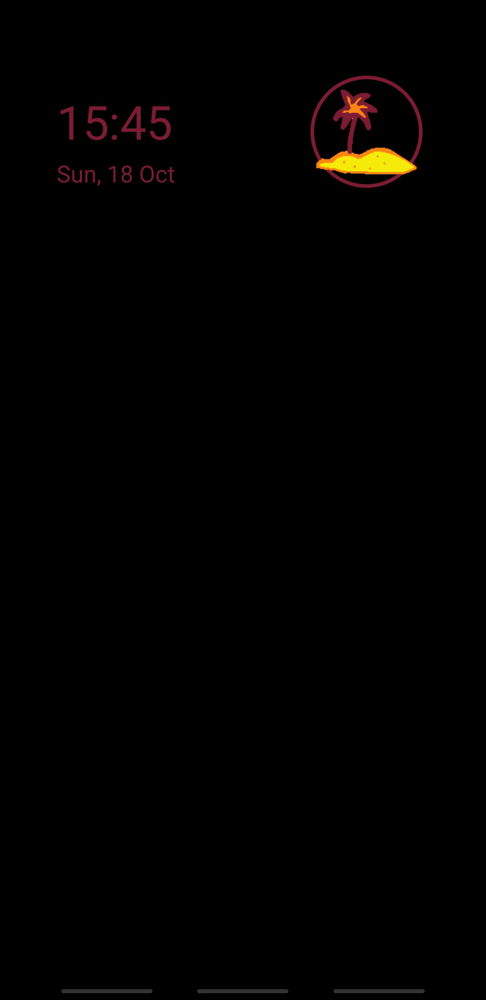
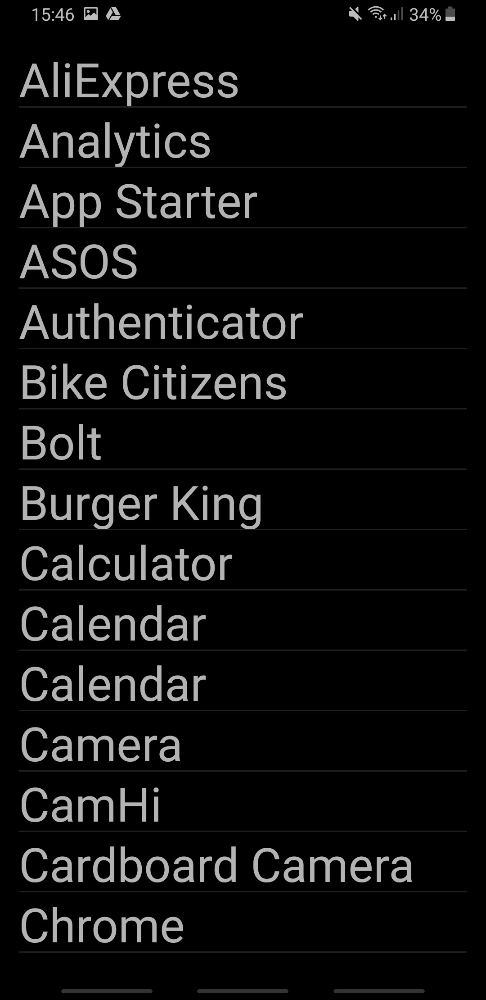

Digital Oasis
=============

This is a project inspired by [Digital Island](https://experiments.withgoogle.com/desert-island) by Google.

Features:

* Empty launcher screen with a clock and a button
* App List can start applications
* Black background (night mode)

 

So far the differences:

* Night mode (for Amoled Screens)
* No applications on the home screen.
* Not in the play store :)
* No statistics counter
